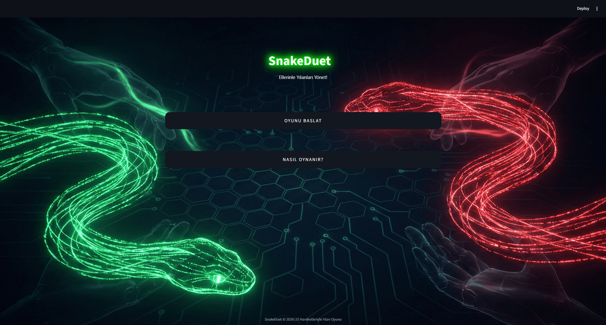
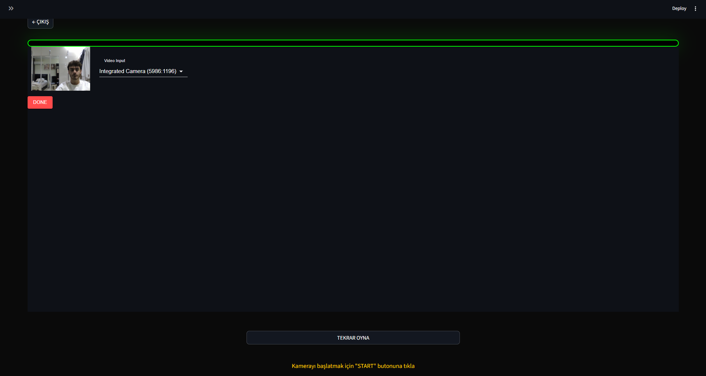
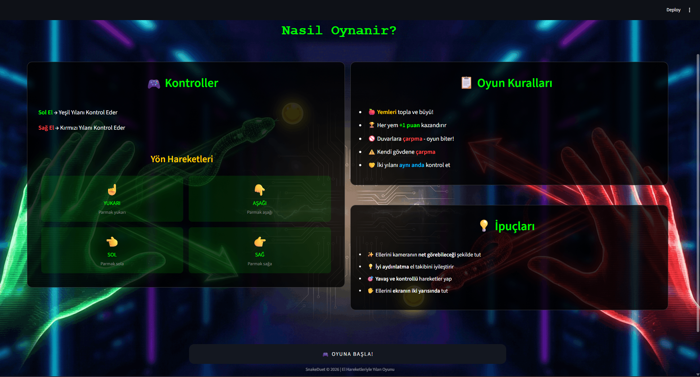
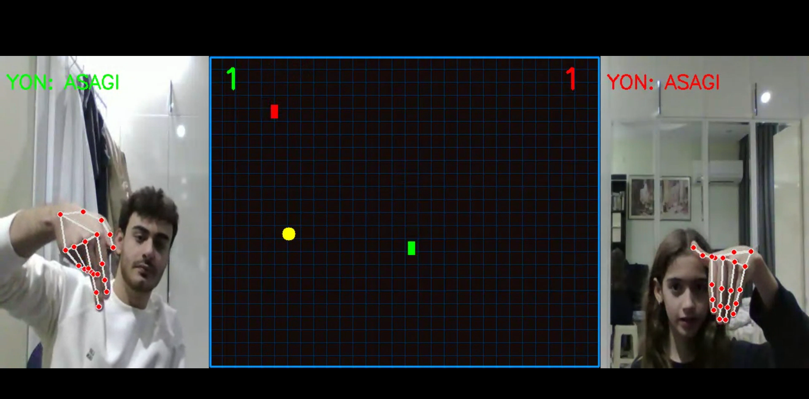

# 🐍 SnakeDuet — El Hareketleriyle Kontrol Edilen Çift Yılanlı Oyun

<p align="center">
  <a href="https://streamlit.io/">
    
  </a>
  <a href="https://opencv.org/">
    
  </a>
  <a href="https://mediapipe.dev/">
    
  </a>
  <a href="https://webrtc.org/">
    
  </a>
</p>

> İki oyuncunun el hareketleriyle aynı anda iki farklı yılanı kontrol ettiği, bilgisayar görüşü destekli klasik yılan oyunu.

## 📋 Proje Hakkında

**SnakeDuet**; kamera aracılığıyla el hareketlerini algılayan, iki oyuncunun aynı anda yeşil ve kırmızı yılanları kontrol ettiği yenilikçi bir oyun uygulamasıdır. Sol el yeşil yılanı, sağ el kırmızı yılanı kontrol eder. Parmak yönünüze göre yılanınız hareket eder!

- **Framework**: Streamlit + WebRTC
- **Bilgisayar Görüşü**: OpenCV + MediaPipe Hands
- **Gerçek Zamanlı İşleme**: streamlit-webrtc
- **Özellikler**: 
  - Çift oyunculu mod (aynı kamerada)
  - Gerçek zamanlı el takibi
  - Neon grid oyun tahtası
  - Çarpışma algılama
  - Skor takibi
  - Ekran sınırlarından geçiş (wrap-around)

## 🎬 Oynayış Videosu

<p align="center">
  <video src="https://github.com/user-attachments/assets/83b0a265-33db-4b29-9ec8-2871411ccda6" width="85%" controls></video>
</p>

## 🖼️ Ekran Görüntüleri

<p align="center">
  <br/>
  <em>Ana Sayfa - Oyunu Başlat veya Nasıl Oynanır?</em>
</p>

<p align="center">
  <br/>
  <em>Kamera/Cihaz Seçim Ekranı</em>
</p>

<p align="center">
  <br/>
  <em>Nasıl Oynanır - Oyun Kuralları ve Kontroller</em>
</p>

<p align="center">
  <br/>
  <em>Oyun İçi Ekran - El Hareketleriyle Yılan Kontrolü</em>
</p>

## 🛠️ Kullanılan Teknolojiler

### Backend & Frontend

| Teknoloji | Açıklama |
|-----------|----------|
| **Streamlit** | Web arayüzü ve sayfa yönetimi |
| **streamlit-webrtc** | Gerçek zamanlı video akışı |
| **OpenCV** | Görüntü işleme ve çizim |
| **MediaPipe Hands** | El ve parmak takibi |
| **NumPy** | Matris işlemleri |

### Oyun Mekanikleri

| Bileşen | Açıklama |
|---------|----------|
| **Yılan Sınıfı** | Hareket, büyüme, çarpışma kontrolü |
| **Yem Sınıfı** | Rastgele spawn, yenme kontrolü |
| **Video İşleyici** | El algılama, oyun döngüsü, çizim |

## 🎮 Nasıl Oynanır?

### Kontroller

| El | Yılan | Renk |
|----|-------|------|
| **Sol El** | Yeşil Yılan | 🟢 |
| **Sağ El** | Kırmızı Yılan | 🔴 |

### Yön Hareketleri

| Hareket | Yön |
|---------|-----|
| ☝️ Parmak Yukarı | YUKARI |
| 👇 Parmak Aşağı | AŞAĞI |
| 👈 Parmak Sola | SOL |
| 👉 Parmak Sağa | SAĞ |

### Oyun Kuralları

1. **Yem Toplama**: Sarı yemleri yiyerek puan kazan ve büyü
2. **Çarpışma Kaçınma**: Rakip yılana veya kendi gövdene çarpma
3. **Ekran Sınırları**: Ekrandan çıkınca karşı taraftan devam et
4. **Kazanma**: Rakip yılan çarpışırsa sen kazanırsın!

## 🚀 Kurulum

### Gereksinimler

- **Python** (3.8+)
- **Webcam** (kamera)

### 1) Depoyu Klonlayın

```bash
git clone https://github.com/BurakYucelPY/SnakeDuet.git
cd SnakeDuet
```

### 2) Sanal Ortam Oluşturun (Önerilir)

```bash
python -m venv venv
# Windows
venv\Scripts\activate
# Linux/Mac
source venv/bin/activate
```

### 3) Bağımlılıkları Yükleyin

```bash
pip install streamlit opencv-python mediapipe streamlit-webrtc numpy
```

### 4) Uygulamayı Başlatın

```bash
streamlit run app.py
```

Uygulama varsayılan olarak `http://localhost:8501` adresinde çalışacaktır.

## 📁 Proje Yapısı

```
SnakeDuet/
├─ app.py                    # Ana sayfa - Streamlit giriş noktası
├─ game.py                   # Oyun sınıfları (Yilan, Yem)
├─ processor.py              # Video işleyici (MediaPipe + OpenCV)
├─ pages/
│  ├─ oyun_Sayfasi.py        # WebRTC oyun sayfası
│  └─ nasil_Oynanir.py       # Nasıl oynanır sayfası
├─ utils/
│  ├─ __init__.py
│  └─ styles.py              # Ortak stiller ve yardımcı fonksiyonlar
├─ assets/
│  ├─ foto.png               # Ana sayfa arkaplan görseli
│  └─ nasiloynanirFoto.png   # Nasıl oynanır arkaplan görseli
├─ readMeImage/              # README görselleri
│  ├─ SnakeDuet.mp4          # Oynayış videosu
│  ├─ anasayfa.png           # Ana sayfa ekran görüntüsü
│  ├─ cihazSecimi.png        # Cihaz seçimi ekran görüntüsü
│  ├─ nasil.png              # Nasıl oynanır ekran görüntüsü
│  └─ oyunIci.png            # Oyun içi ekran görüntüsü
└─ README.md
```

## 💡 Nasıl Çalışır?

### 1. **Kamera Başlatma**
Kullanıcı "OYUNU BAŞLAT" butonuna tıklar ve kamera erişim izni verir.

### 2. **El Algılama**
MediaPipe Hands modeli, kameradan gelen görüntüdeki elleri ve parmak uçlarını algılar.

### 3. **Yön Hesaplama**
```python
# Bilek ve işaret parmağı ucu arasındaki fark hesaplanır
fark_x = parmak_ucu_x - bilek_x
fark_y = bilek_y - parmak_ucu_y

# Hassasiyet eşiğine göre yön belirlenir
if abs(fark_x) > abs(fark_y):
    if fark_x > hassasiyet: yon = "SAG"
    elif fark_x < -hassasiyet: yon = "SOL"
else:
    if fark_y > hassasiyet: yon = "YUKARI"
    elif fark_y < -hassasiyet: yon = "ASAGI"
```

### 4. **Sol/Sağ El Ayrımı**
Kamera görüntüsü ortadan ikiye bölünür:
- Sol yarıdaki el → Yeşil yılanı kontrol eder
- Sağ yarıdaki el → Kırmızı yılanı kontrol eder

### 5. **Oyun Döngüsü**
Her frame'de:
1. Eller algılanır ve yönler hesaplanır
2. Yılanlar hareket ettirilir
3. Yem yeme ve çarpışma kontrolleri yapılır
4. Oyun tahtası ve yılanlar çizilir
5. Final görüntü oluşturulur (Sol kamera + Oyun + Sağ kamera)

## 🎯 Örnek Kullanım Senaryosu

1. Kullanıcı uygulamayı başlatır ve **"OYUNU BAŞLAT"** butonuna tıklar.
2. Kamera seçer ve **"START"** butonuna basar.
3. Ellerini kameraya gösterir ve geri sayım başlar.
4. Oyun başladığında sol eliyle yeşil yılanı, sağ eliyle kırmızı yılanı kontrol eder.
5. Yemleri toplayarak skor yapar ve rakip yılana çarpmamaya çalışır.
6. Bir yılan çarpıştığında oyun biter ve kazanan ilan edilir.
7. Tekrar oynamak için ellerini gösterir veya butona tıklar.

## ⚙️ Önemli Ayarlar

### Video İşleyici (processor.py)

| Parametre | Değer | Açıklama |
|-----------|-------|----------|
| `OYUN_GENISLIK` | 600 | Oyun tahtası genişliği |
| `OYUN_YUKSEKLIK` | 480 | Oyun tahtası yüksekliği |
| `max_num_hands` | 2 | Algılanacak maksimum el sayısı |
| `hassasiyet` | 30 | Yön değişimi için minimum piksel farkı |
| `hiz` | 10 | Yılan hareket hızı |

### WebRTC (oyun_Sayfasi.py)

| Parametre | Değer | Açıklama |
|-----------|-------|----------|
| `video.width` | 1920 (ideal) | Video genişliği |
| `video.height` | 1080 (ideal) | Video yüksekliği |
| `audio` | False | Ses devre dışı |

## 🐛 Sorun Giderme

| Sorun | Çözüm |
|-------|-------|
| **Kamera açılmıyor** | Tarayıcının kamera izinlerini kontrol edin. HTTPS veya localhost gerekli. |
| **El algılanmıyor** | Aydınlık bir ortamda olduğunuzdan ve ellerinizin tam görüntüde olduğundan emin olun. |
| **Yılan yanlış yöne gidiyor** | Parmağınızı daha belirgin şekilde gösterin, hassasiyet eşiğinin üzerinde olsun. |
| **Gecikme yaşanıyor** | Daha güçlü bir bilgisayar veya daha düşük çözünürlük deneyin. |
| **ModuleNotFoundError** | Tüm bağımlılıkların yüklendiğinden emin olun: `pip install -r requirements.txt` |

## 📌 Notlar

- **Çift Oyuncu**: Aynı kamerada iki kişi yan yana oturarak oynayabilir.
- **Tek Oyuncu**: İki elinizi kullanarak her iki yılanı da kontrol edebilirsiniz.
- **Performans**: MediaPipe GPU desteği için ilgili kurulumları yapabilirsiniz.
- **Tarayıcı Uyumu**: Chrome veya Firefox önerilir.

## 🎨 Özelleştirme

- **Yılan Hızı**: `game.py` içinde `hiz` değişkenini değiştirin.
- **Hassasiyet**: `processor.py` içinde `hassasiyet` değişkenini ayarlayın.
- **Renkler**: `Yilan` sınıfında renk değerlerini (BGR formatında) değiştirin.
- **Oyun Boyutu**: `OYUN_GENISLIK` ve `OYUN_YUKSEKLIK` değerlerini ayarlayın.
- **Arkaplan**: `assets/` klasöründeki görselleri değiştirin.

## 📄 Lisans

Bu proje eğitim amaçlıdır ve açık kaynaklıdır. Kendi projelerinizde kullanabilirsiniz.

---
<p align="center">
  Made with ❤️ by <a href="https://github.com/BurakYucelPY">Burak Yücel</a>
</p>
